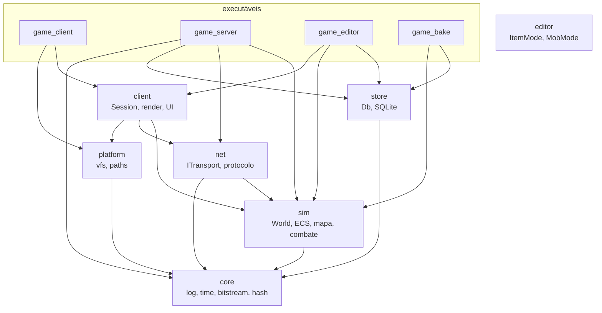
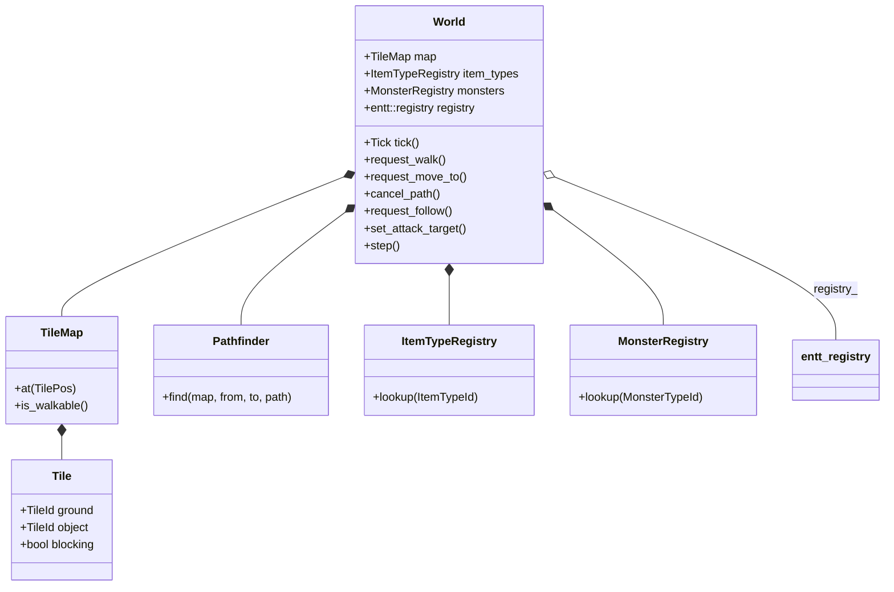
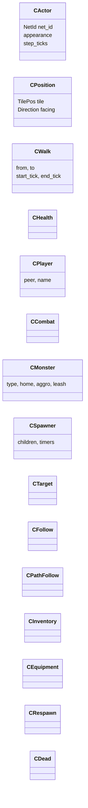
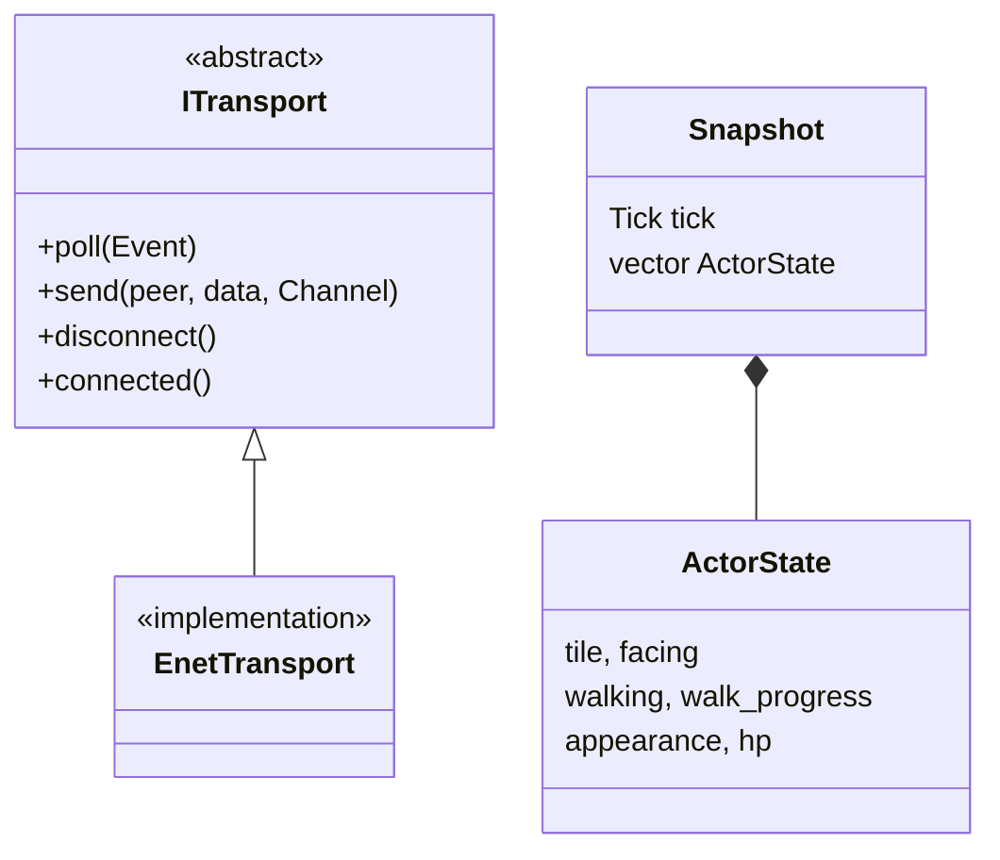
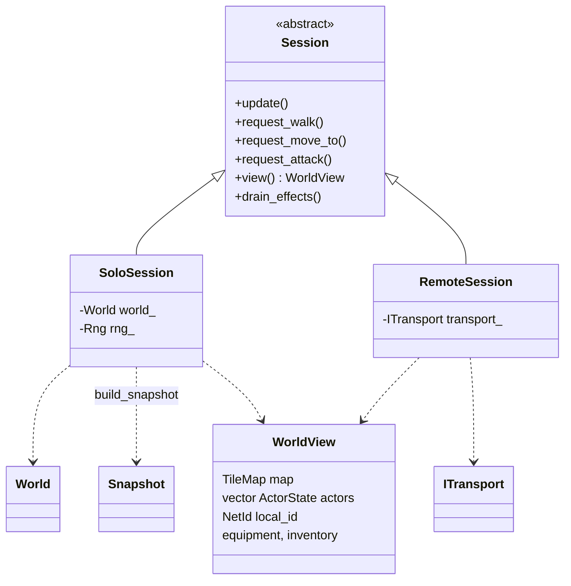
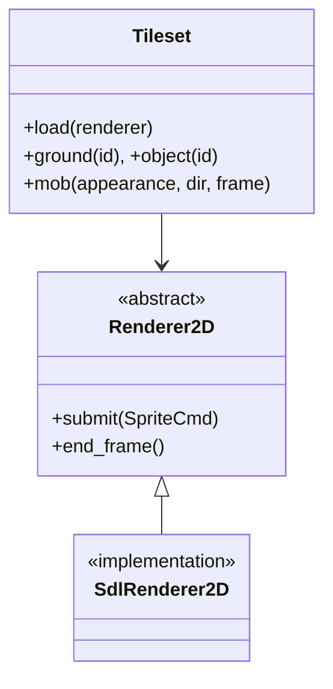
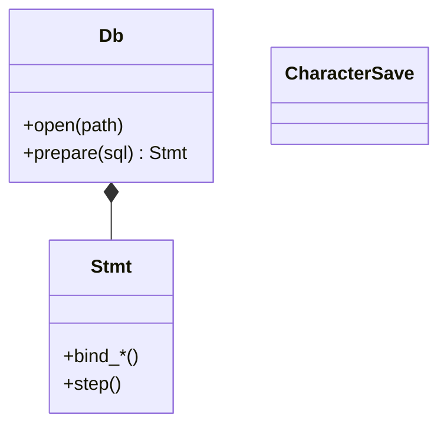
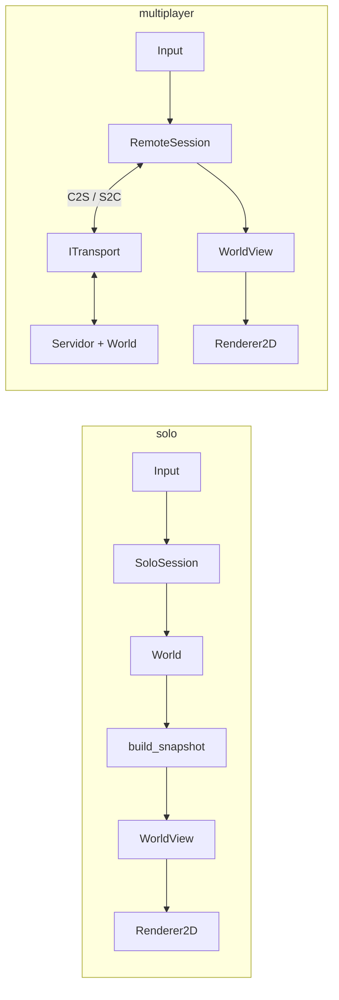
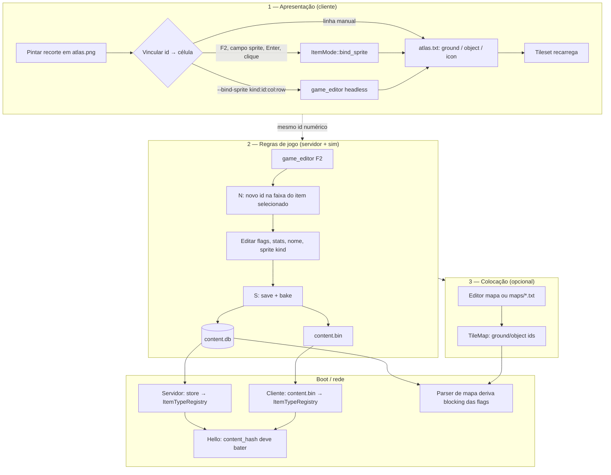
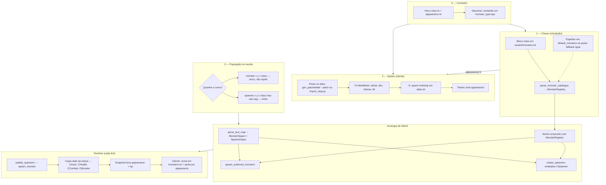

# Mapa de classes

Visão das classes e structs principais em `src/`, complementando
[architecture.md](architecture.md) (decisões) com nomes e relações. Diagramas em
Mermaid — GitHub e muitos editores renderizam nativamente.

## Módulos e executáveis



| Módulo | Headers principais |
|--------|-------------------|
| `core/` | `log.hpp`, `time.hpp`, `bitstream.hpp`, `hash.hpp` |
| `sim/` | `world.hpp`, `components.hpp`, `systems.hpp`, `snapshot.hpp`, `tile_map.hpp`, `pathfind.hpp`, `item_type.hpp`, `monster_type.hpp` |
| `net/` | `transport.hpp`, `protocol.hpp` |
| `platform/` | `vfs.hpp`, `paths.hpp` |
| `client/` | `session.hpp`, `renderer2d.hpp`, `tileset.hpp`, `world_render.hpp`, `iso.hpp`, `animation.hpp` |
| `store/` | `db.hpp`, `content.hpp`, `players.hpp`, `schema.hpp` |
| `editor/` | `item_mode.hpp`, `mob_mode.hpp`, `map_browser.hpp`, `atlas_meta.hpp` |

## Simulação: `World` e mapa



`World` também mantém mapas auxiliares: `by_net_id_`, `occupancy_`, `ground_`
(loot no chão), fila `attack_events_`.

## Componentes ECS (`sim/components.hpp`)

Entidades são `entt::entity` no `World::registry()`. Componentes são structs
planas; presença/ausência define estado (ex.: sem `CWalk` = parado).



| Entidade típica | Componentes |
|-----------------|-------------|
| Jogador (servidor) | `CActor`, `CPosition`, `CHealth`, `CPlayer`, `CInventory`, `CEquipment`, `CRespawn`; opcional `CWalk`, `CTarget`, `CFollow`, `CPathFollow`, `CDead` |
| Mob | `CActor`, `CPosition`, `CHealth`, `CCombat`, `CMonster`; opcional `CTarget`, `CFollow`, `CWalk`, `CPathFollow` |
| Spawner | só `CSpawner` (sem `CActor` — não entra em snapshot) |

## Sistemas (funções, não classes)

Ordem fixa após `World::step()` (servidor e `SoloSession`):

1. `update_spawners`
2. `update_monsters`
3. `update_chasers`
4. `update_path_followers`
5. `update_combat`

Outras entradas em `systems.hpp`: `spawn_monster`, `combat_stats`, helpers de
spawn do mapa.

## Rede e snapshot



Mensagens de fio (`protocol.hpp`): `HelloMsg`, `InputMsg`, `MoveToMsg`,
`AttackMsg`, `EquipMsg`, `WelcomeMsg`, `MapChunkMsg`, `EffectMsg`, etc.

`build_snapshot(world, center, out)` preenche `Snapshot` pela área de interesse.

## Cliente: sessão e render





Fábricas: `make_solo_session`, `make_remote_session`, `create_server` /
`create_client` (transporte).

Apresentação auxiliar: `EffectFeed`, `DamageFeed`, `InventoryUI`; funções em
`world_render.hpp`, `battle_list.hpp` (header-only).

## Servidor (`server/main.cpp`)

Não há classe `Server` pública — o loop vive em `main`. Structs locais:

| Struct | Conteúdo |
|--------|----------|
| `ServerWorld` | `sim::World` + spawn opcional + listas de `MonsterSpawn` / `SpawnerSpec` do parse |
| `Connection` | `PeerId`, `NetId`, nome, chunks já enviados (`sent_chunks`), `character_id` SQLite |

Persistência: `store::Db` + `CharacterSave` via `snapshot_character` /
`save_character`.

## Store



Cliente **não** linka `store/` — lê `content.bin` via `platform::vfs`.
Servidor e `game_editor` / `game_bake` usam SQLite.

## Editor

| Tipo | Papel |
|------|--------|
| `MapDoc`, `Brush` | Tiles por andar |
| `ItemMode` | Tipos no `content.db` |
| `MobMode`, `MobRow` | Preview de mob / atlas |
| `MapBrowser` | Escolha de mapa |
| `AtlasBinding`, `MobStrip` | Metadados de `atlas.txt` |

## Fluxo de dados: solo vs rede



## Fluxo: clique para atacar um mob

O cliente manda **quem**, não **onde**. Perseguir e bater ficam no servidor (ou no
`World` no solo).

```mermaid
sequenceDiagram
  participant UI as Cliente UI
  participant RS as Session
  participant NET as ITransport / solo
  participant SRV as Servidor ou SoloSession
  participant W as World
  participant SYS as update_chasers / update_combat

  UI->>RS: request_attack(target NetId)
  alt multiplayer
    RS->>NET: C2S_Attack
    NET->>SRV: handler
  end
  SRV->>W: set_attack_target(attacker, target)
  SRV->>W: request_follow(attacker, target)
  Note over W: cancel_path implícito no input manual;<br/>attack handler não cancela rota sozinho —<br/>follow + chasers replanejam

  loop cada tick
    W->>W: step()
    SYS->>W: update_monsters (mobs)
    SYS->>W: update_chasers (CFollow → request_move_to)
    SYS->>W: update_path_followers
    SYS->>W: update_combat (CTarget, alcance, dano)
  end

  SRV-->>NET: Snapshot + S2C_Effect
  NET-->>RS: WorldView + drain_effects
  RS-->>UI: battle list, animação, EffectFeed
```

Invariantes relevantes (detalhes em `CLAUDE.md`):

- `set_attack_target` com o **mesmo** alvo não reseta cooldown.
- `World::cancel_path` cancela perseguição (`CFollow`) — input manual retoma controle.
- `update_chasers` roda **antes** de `update_path_followers` no mesmo tick.

## Fluxo: criar um item (tipo novo)

Um `ItemTypeId` junta **três camadas** (ver [authoring.md](authoring.md)): arte
(`atlas`), regras (`content.db`) e colocação no mapa. Só arte deixa o id visível
no cliente, mas a simulação trata como desconhecido até existir linha no banco.

Receita passo a passo: **Receita A** em [authoring.md](authoring.md).



| Etapa | Se pular… |
|-------|-----------|
| Só `atlas.txt` | Cliente desenha; servidor não conhece flags (bloqueio, loot, etc.) |
| Só `content.db` | Simulação sabe o tipo; cliente usa sprite ausente ou fallback |
| Mapa sem rebake após editar DB fora do editor | Cliente rejeitado: `content mismatch` — rodar `game_bake` ou `S` no editor |
| Id reciclado | Mapas e clientes antigos quebram — usar `N` no editor, `shift+del` para aposentar |

Código: `ItemMode::save` / `bake` em `src/editor/item_mode.cpp`; carga no cliente
em `client::load_item_catalogue()`; no servidor em `store/content.hpp`.

---

## Fluxo: criar um mob (classe nova + aparecer no mundo)

Mob = **classe** (`monsters.txt`, simulação) + **aparência** (`appearance` →
`mobstrip` no `atlas.txt`, cliente) + **spawn no mapa**. O modo **F4** só grava
`atlas.txt`; **não** edita `monsters.txt`.



**Só balancear** uma classe existente: editar `monsters.txt` e rodar — sem bake,
sem build. Se o parse falhar, cai em `default_monsters()` e o log explica.

**Classe nova mínima:**

1. Entrada `class` em `monsters.txt` (hp, attack, `step_ticks`, aggro, `appearance`, loot…).
2. Linha `mobstrip` (ou `mob`) com o mesmo `appearance`.
3. Linha `monster` ou `spawner` no mapa (ou `--wanderers` só para teste rápido).

Receitas: **B3–B5** em [authoring.md](authoring.md); animação em [animation.md](animation.md).

| Arte | Simulação | Mapa |
|------|-----------|------|
| `appearance` no atlas | `class id` em monsters.txt | referencia **class id**, não appearance |
| F4 → `MobMode::save` | editar texto + reiniciar servidor/cliente | editor ainda não coloca mob/ninho na UI — `.txt` ou gerador |

Código: `spawn_monster` / `update_spawners` em `systems.hpp`; parse em
`monster_io.cpp`; bind em `mob_mode.cpp`; spawn do mapa em `map_io` + boot do
servidor/solo.

## Onde ler o código

| Conceito | Arquivo |
|----------|---------|
| API da simulação | `src/sim/include/sim/world.hpp` |
| Componentes | `src/sim/include/sim/components.hpp` |
| Tick loop dos sistemas | `src/sim/include/sim/systems.hpp` |
| Contrato do cliente | `src/client/include/client/session.hpp` |
| Solo | `src/client/src/solo_session.cpp` |
| Rede | `src/client/src/remote_session.cpp` |
| Servidor | `src/server/main.cpp` |
| Protocolo | `src/net/include/net/protocol.hpp` |
